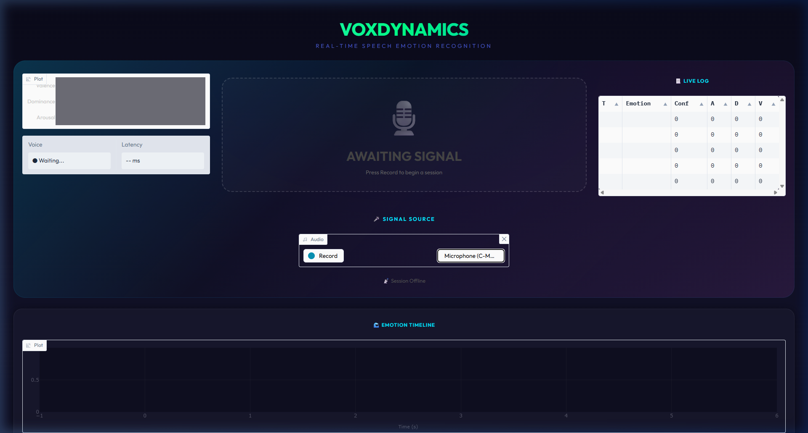
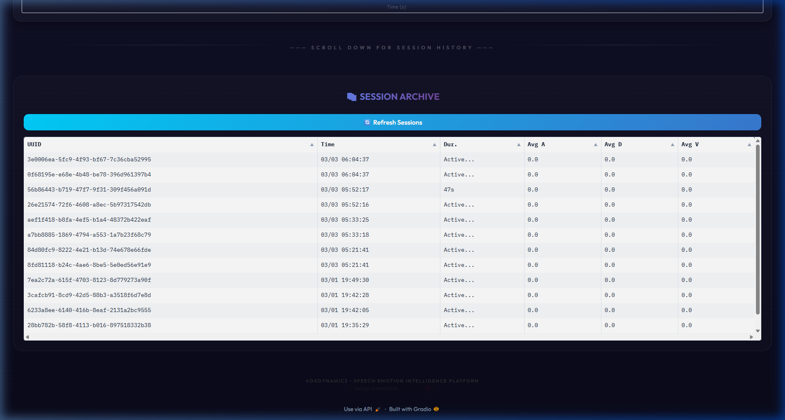

# 🎙️ VoxDynamics: Real-Time Speech Emotion Intelligence

VoxDynamics is a high-performance, real-time Speech Emotion Recognition (SER) system built with **Gradio**, **FastAPI**, and **Wav2Vec2**. It features a modern Single-Page Architecture (SPA) inspired by Google Meet, providing an immersive recording experience with deep analytical insights.

---

## ✨ Key Features

- **Google Meet-Style Interface**: A centered "Hero Stage" for live recording and real-time visualization.
- **Real-Time SER Pipeline**: 
  - **Silero VAD**: High-accuracy Voice Activity Detection.
  - **Wav2Vec2-Large-Robust**: Precise dimensional emotion prediction (Arousal/Dominance/Valence).
  - **EMA Smoothing**: Stable, non-jittery tracking of emotional shifts.
- **Session Archive**: A persistent historical table located "below the fold" for easy data retrieval.
- **Deep Analytics**: Automatic generation of Pie charts and Time-series graphs for every recorded session.
- **Language Agnostic**: Intelligence based on acoustic prosody, working across any language.

---

## 📸 Screenshots

### The Hero Stage (Live Recording)
Centered mic, live emotion display with emoji, dimensional gauges, and log stream.



### The Archive & Analytics
Historical session table and detailed session-specific analytics.



---

## 🛠️ Technology Stack

- **Backend**: Python, FastAPI, SQLAlchemy (Async), PostgreSQL.
- **AI Core**: PyTorch, Transformers (HuggingFace), Silero VAD.
- **Frontend**: Gradio, Plotly, Custom Glassmorphism CSS.
- **DevOps**: Docker, Docker Compose.

---

## 🚀 Quick Start (Docker)

1. **Clone the repository**:
   ```bash
   git clone <repository-url>
   cd VoxDynamics
   ```

2. **Start the system**:
   ```bash
   docker-compose up -d --build
   ```

3. **Access the Dashboard**:
   Open [http://localhost:8000/](http://localhost:8000/) in your browser.

---

## 🧠 Technical Highlights

- **Centroid-Based Mapping**: Custom-calibrated geometric mapping from 3D (A,D,V) space to discrete labels (Happy, Neutral, Sad, etc.).
- **Automatic Session Management**: Recording starts and saves sessions automatically, eliminating manual controls.
- **Asynchronous Data Layer**: Non-blocking ingestion ensures zero latency in the audio processing loop during DB writes.

---