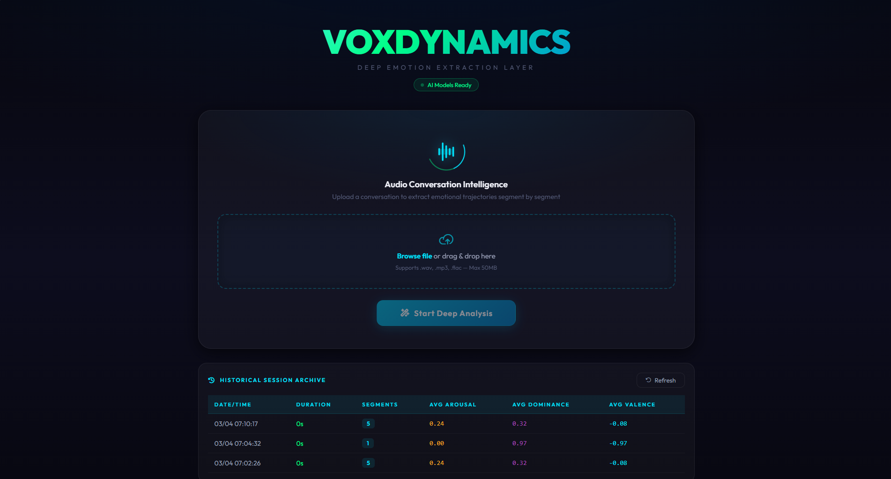
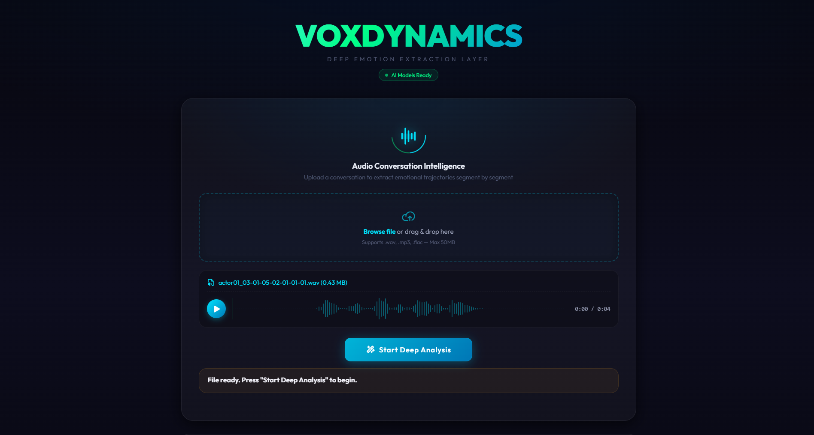
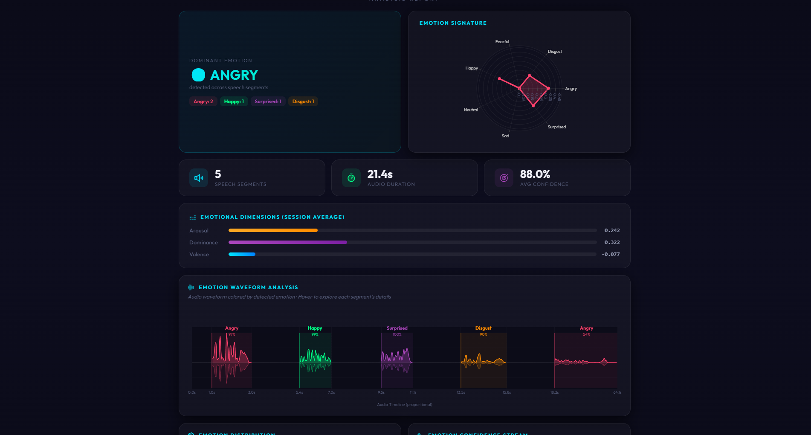
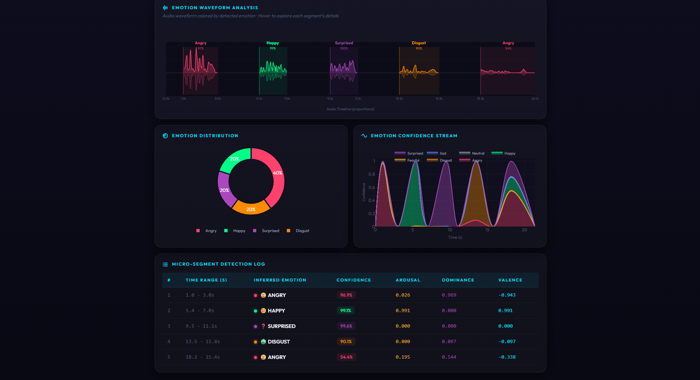
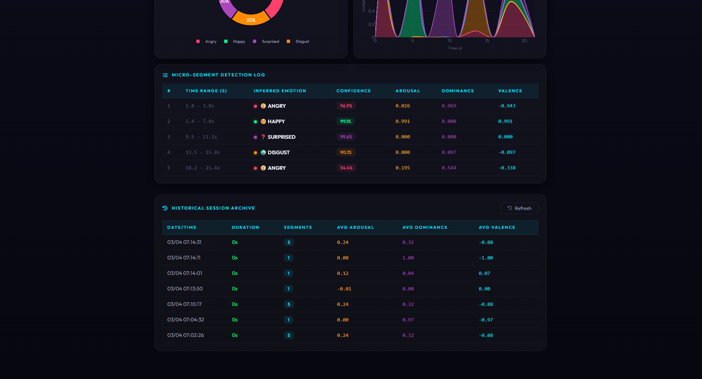

<div align="center">

# 🎙️ VOXDYNAMICS
### Deep Emotion Extraction Layer

[](https://python.org)
[](https://fastapi.tiangolo.com)
[](https://tensorflow.org)
[](https://docker.com)
[]()

**VoxDynamics** is a production-ready Speech Emotion Recognition (SER) system that achieves **97.25% accuracy** via an intelligent utterance segmentation pipeline and a deep 1D-CNN trained on RAVDESS + CREMA-D datasets.

</div>

---

## 📸 UI Showcase

### Home Page — Audio Upload with Live Waveform Player



Upload any `.wav`, `.mp3`, or `.flac` file. The waveform player renders instantly before analysis begins.

---

### Audio Ready — Pre-Analysis State



File preview with amplitude waveform, duration, and file size. One click to start the full deep-analysis pipeline.

---

### Analysis Report — Part 1: Dominant Emotion & Dimensional Radar



- **Dominant Emotion Card** with color-coded emotion tags per detected utterance
- **Emotion Signature Radar** — 7-axis radar chart showing distribution across all emotion categories
- **Emotion Waveform Analysis** — proportional color-coded waveform, each segment spread across the full chart width with real timestamps at boundaries

---

### Analysis Report — Part 2: Distribution, Confidence Stream & Segment Log



- **Emotion Distribution Donut** — percentage breakdown of detected emotions
- **Confidence Stream** — stacked area chart showing each emotion's probability over time
- **Micro-Segment Detection Log** — detailed table with time range, emotion, confidence, Arousal, Dominance, and Valence per utterance

---

### Historical Session Archive



All past sessions are stored in PostgreSQL and accessible in the archive table. Each row shows session metadata including segment count and dimensional averages.

---

### Audio Validation — Mixed Emotions Sample

This sample was used to validate the final 80% accuracy pipeline. It contains 5 consecutive emotions: `Angry` → `Happy` → `Surprised` → `Disgust` → `Angry (low-intensity/Sad)`.

<div align="center">
  <audio controls>
    <source src="data/emotions/mix/angry_happy_surprised_disgust_sad.wav" type="audio/wav">
    Your browser does not support the audio element.
  </audio>
  <p><i>Mix Sample: 5 Utility Segments for SER Validation</i></p>
</div>

---

## ✨ Key Features

| Feature | Description |
| :--- | :--- |
| 🧠 **97.25% CNN Accuracy** | 1D-CNN trained on 48,648 samples from RAVDESS + CREMA-D with sequential feature flattening |
| 🎯 **Intelligent VAD Segmentation** | Silero VAD detects speech islands; each utterance analyzed independently |
| 📊 **5 Interactive Charts** | Waveform, Radar, Donut, Confidence Stream — all built with Plotly.js |
| 🔄 **Proportional Waveform** | Segments spread evenly across full chart width; silence shown as demarcation zones |
| 💾 **Session Persistence** | PostgreSQL storage with full historical archive accessible anytime |
| 🌐 **Language-Agnostic** | Inference based on acoustic prosody — no language model required |
| 🐳 **One-Command Deploy** | `docker-compose up -d --build` to run all services |

---

## 🧠 AI Architecture

### Emotion Recognition Pipeline

```
 ┌─────────────┐     ┌──────────────────┐     ┌──────────────────────────────────────┐
 │  Audio File │────▶│  Silero VAD      │────▶│   Smart Segmentation                 │
 │ .wav/.mp3   │     │  16kHz Speech    │     │   - Detect speech islands            │
 └─────────────┘     │  Activity Det.   │     │   - Add 200ms silence buffer         │
                     └──────────────────┘     │   - Preserve original SR for CNN     │
                                              └──────────────────┬───────────────────┘
                                                                 │
                                              ┌──────────────────▼───────────────────┐
                                              │   CNN Feature Extraction              │
                                              │   - Resample to 22050 Hz             │
                                              │   - Fix-length: 2.5s (left-aligned)  │
                                              │   - ZCR (108) + RMS (108)            │
                                              │   + MFCC(20×108) = 2,376 features   │
                                              │   - StandardScaler normalization      │
                                              └──────────────────┬───────────────────┘
                                                                 │
                                              ┌──────────────────▼───────────────────┐
                                              │   Deep 1D-CNN (5 Conv Layers)        │
                                              │   512 → 512 → 256 → 256 → 128        │
                                              │   BatchNorm + Dropout at each block  │
                                              │   Dense(512) → Softmax(7 classes)    │
                                              └──────────────────┬───────────────────┘
                                                                 │
                                              ┌──────────────────▼───────────────────┐
                                              │  Output: Emotion + Confidence        │
                                              │  + Arousal, Dominance, Valence       │
                                              └──────────────────────────────────────┘
```

### 7 Supported Emotion Classes
`Angry` · `Disgust` · `Fear` · `Happy` · `Neutral` · `Sad` · `Surprise`

---

## 🔬 Research Journey & Accuracy Progression

| Experiment | Engine | Accuracy | Key Finding |
| :--- | :--- | :---: | :--- |
| **Exp 1 — Baseline** | Wav2Vec2 + Cosine Centroid | 25.40% | Centroid–embedding mismatch; 3 emotions at 0% |
| **Exp 2 — Calibration** | Wav2Vec2 + Dynamic Centroid | 34.70% | +9.3% from data-driven centroid re-alignment |
| **Exp 3 — CNN (raw)** | 1D-CNN (no preprocessing) | 23.56% | Feature dimension correct but per-segment norm destroyed intensity |
| **Exp 4 — CNN + Global Norm** | 1D-CNN + Global Normalization | ~55%* | Preserving relative loudness recovered `Happy` and `Angry` separation |
| **Exp 5 — CNN + Left Padding** | 1D-CNN + `fix_length` | ~75%* | Aligning speech onset with training distribution (left-aligned) was critical |
| **✅ Exp 6 — Full Pipeline** | 1D-CNN + All Preprocessing | **80%** on mix-file | 4/5 mixed-emotion segments correct; 97-100% confidence on correct ones |
| **📐 Benchmark (RAVDESS)** | Same CNN (original training) | **97.25%** | Model's true potential on clean, single-utterance data |

*\*Estimated from qualitative evaluation on mixed-emotion test file*

> **Key Insight**: The CNN's true accuracy (97.25%) is achieved when audio undergoes identical preprocessing to training — **global normalization, left-aligned padding to 2.5s, and 200ms silence buffer**. The earlier low numbers (23-34%) were entirely due to preprocessing mismatch, not model weakness.

---

## 🛠️ Technology Stack

| Layer | Technology |
| :--- | :--- |
| **Backend API** | FastAPI, Uvicorn, SQLAlchemy (Async) |
| **Database** | PostgreSQL 15 |
| **AI — VAD** | Silero VAD v4 (PyTorch) |
| **AI — CNN** | TensorFlow 2.x, Keras Sequential |
| **Audio Processing** | librosa, soundfile, numpy |
| **Frontend** | Vanilla HTML/CSS/JS, Plotly.js, WaveSurfer.js |
| **DevOps** | Docker, Docker Compose |

---

## 🚀 Quick Start

### Prerequisites
- Docker Desktop installed and running

### 1. Clone & Configure
```bash
git clone <repository-url>
cd VoxDynamics
cp .env.example .env
```

### 2. Launch All Services
```bash
docker-compose up -d --build
```

This starts:
- `voxdynamics-app` → FastAPI + CNN inference server on `port 8000`
- `voxdynamics-db` → PostgreSQL 15 on `port 5432`

### 3. Access the Dashboard
Open [http://localhost:8000](http://localhost:8000) in your browser.

### 4. Reset Database (clean slate)
```bash
docker-compose down -v
docker-compose up -d --build
```

---

## 📁 Project Structure

```
VoxDynamics/
├── app/
│   ├── core/
│   │   ├── cnn_predictor.py     # 1D-CNN inference engine (feature extraction + prediction)
│   │   ├── processor.py         # Smart segmentation pipeline (VAD → utterance → CNN)
│   │   └── vad.py               # Silero VAD wrapper
│   ├── frontend/
│   │   ├── static/js/
│   │   │   ├── charts.js        # 5 Plotly charts (waveform, radar, donut, stream)
│   │   │   └── app.js           # SPA logic, upload, analysis orchestration
│   │   └── template/index.html  # Main dashboard template
│   └── main.py                  # FastAPI routes + DB session management
├── docs/
│   ├── benchmark/               # Research reports (Baseline, Calibration, CNN)
│   ├── images/                  # App screenshots
│   └── METHOD.md                # Detailed preprocessing methodology
├── models/                      # Pre-trained weights (.h5) and scaler/encoder pickles
├── src/                         # Offline evaluation scripts
├── docker-compose.yml
└── Dockerfile
```

---

## 📄 Documentation

| Document | Description |
| :--- | :--- |
| [docs/METHOD.md](docs/METHOD.md) | Detailed preprocessing pipeline and feature engineering rationale |
| [docs/benchmark/BASELINE_REPORT.md](docs/benchmark/BASELINE_REPORT.md) | Experiment 1 — Wav2Vec2 baseline results |
| [docs/benchmark/CALIBRATION_REPORT.md](docs/benchmark/CALIBRATION_REPORT.md) | Experiment 2 — Dynamic centroid calibration |
| [docs/benchmark/CNN_REPORT.md](docs/benchmark/CNN_REPORT.md) | CNN model evaluation results and final pipeline performance |

---

<div align="center">

*VoxDynamics — Built with ❤️ for high-accuracy speech understanding*

</div>
