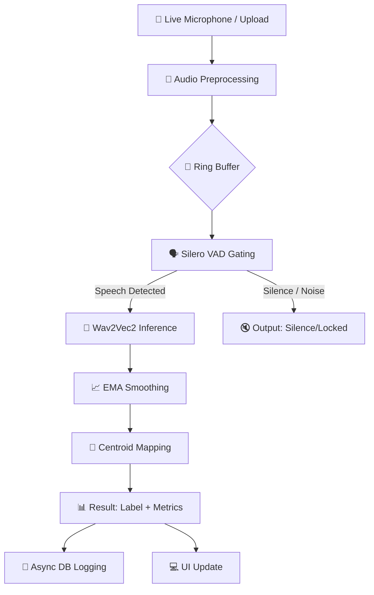

# 🧠 VoxDynamics Technical Methodology

This document details the underlying intelligence pipeline, from raw audio capture to final emotional classification.

## 🔄 System Pipeline Overview

The high-level flow of the VoxDynamics processing engine is visualized below:

---

## 🛠️ Step-by-Step Methodology

### 1. Audio Preprocessing & Ring Buffer
- **Target Format**: All input audio is normalized and resampled to **16kHz, Mono, Float32** to match the model's requirements.
- **Ring Buffer**: We implement a sliding window using a `collections.deque` with a capacity of **3 seconds** of audio samples. This ensures the model has sufficient acoustic context for accurate emotion detection.

### 2. Voice Activity Detection (VAD) Gating
- **Engine**: **Silero VAD** (Voice Activity Detector).
- **Purpose**: To save computation and prevent false positives on silence or background noise.
- **Logic**: The system only triggers the heavy Wav2Vec2 inference if the VAD probability exceeds a set threshold (default: **0.5**).

### 3. Dimensional Emotion Inference (Wav2Vec2)
- **Model**: `audeering/wav2vec2-large-robust-12-ft-emotion-msp-dim`.
- **Architecture**: A pruned 12-layer Wav2Vec2 transformer with a custom `RegressionHead`.
- **Output**: Predicts three continuous emotional dimensions:
  - **Arousal**: Excitation vs. Relaxation.
  - **Dominance**: Control vs. Submissiveness.
  - **Valence**: Positivity vs. Negativity.

### 4. Exponential Moving Average (EMA) Smoothing
- **Problem**: Raw model outputs can be jittery between frames.
- **Solution**: We apply an EMA algorithm ($\alpha=0.5$) to the Arousal, Dominance, and Valence values.
- **Formula**: $EMA_t = \alpha \cdot x_t + (1 - \alpha) \cdot EMA_{t-1}$
- **Result**: Stable, natural-feeling emotion transitions in the UI.

### 5. Centroid-Based Label Mapping
- **Mechanism**: Euclidean distance mapping in 3D (A, D, V) space.
- **Labels**: Smoothed coordinates are compared against calibrated "Centroids" for emotions such as **Happy, Angry, Sad, Neutral, Surprise, Fear, Disgust,** and **Calm**.
- **Classification**: The nearest centroid determines the discrete emotion label.
- **Confidence**: Calculated as $1 / (1 + \text{distance})$.

---

## 📊 Performance & Optimization
- **Latency**: Sub-400ms end-to-end on CPU.
- **Efficiency**: Async DB logging via `asyncio.create_task` ensures data storage never blocks the real-time processing loop.
