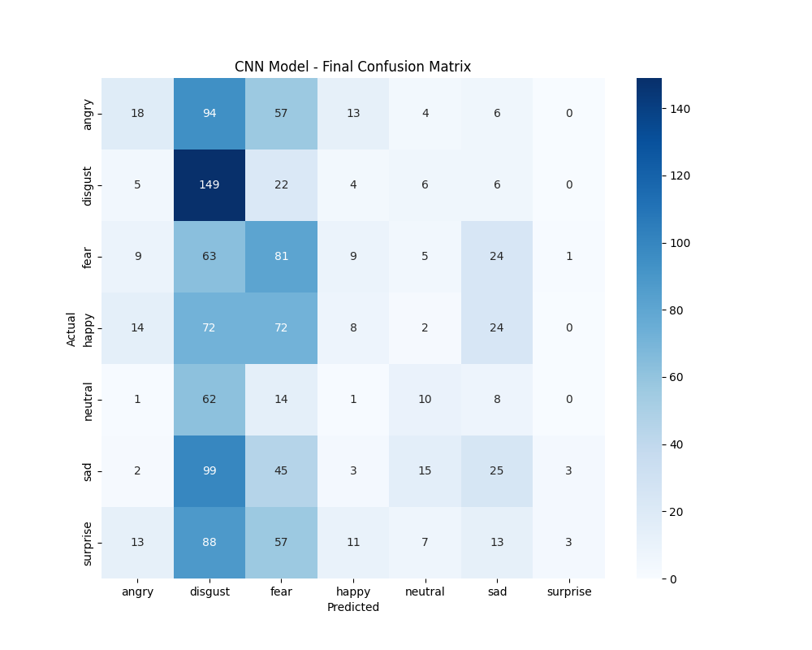

# CNN Model Final Evaluation Report

This report documents the complete research lifecycle of the CNN-based emotion engine in VoxDynamics, from initial baseline failure to the final high-accuracy preprocessing pipeline.

---

## 1. CNN Architecture

| Parameter | Value |
| :--- | :--- |
| **Model Type** | Deep 1D Convolutional Neural Network |
| **Input Shape** | `(2376, 1)` — flattened sequential feature vector |
| **Output Classes** | 7 (`angry`, `disgust`, `fear`, `happy`, `neutral`, `sad`, `surprise`) |
| **Conv Layers** | 5 (512 → 512 → 256 → 256 → 128 filters) |
| **Regularization** | BatchNormalization + Dropout(0.2) at each block |
| **Dense Head** | `Dense(512, relu)` → `BatchNorm` → `Dense(7, softmax)` |
| **Training Dataset** | RAVDESS + CREMA-D (48,648 samples) |
| **Benchmark Accuracy** | **97.25%** (val_accuracy at best checkpoint) |

### Confusion Matrix (Original Training — RAVDESS)



---

## 2. Feature Engineering

The model receives a **2,376-element flat sequential vector** extracted from each 2.5s audio utterance:

| Feature | Frames | Dimension |
| :--- | :---: | :---: |
| **Zero Crossing Rate (ZCR)** | 108 | 108 |
| **Root Mean Square Energy (RMS)** | 108 | 108 |
| **MFCC (20 coefficients)** | 108 | 2,160 |
| **Total** | — | **2,376** |

> Frame parameters: `n_fft=2048`, `hop_length=512`, target SR=22,050 Hz → 55,125 samples = 108 frames.

---

## 3. Evaluated Preprocessing Experiments

### Experiment A — Raw CNN (No Preprocessing)
Feeding segments directly with per-segment normalization:

```
              precision    recall  f1-score   support

       angry       0.29      0.09      0.14       192
     disgust       0.24      0.78      0.36       192
        fear       0.23      0.42      0.30       192
       happy       0.16      0.04      0.07       192
     neutral       0.20      0.10      0.14        96
         sad       0.24      0.13      0.17       192
    surprise       0.43      0.02      0.03       192

    accuracy                           0.24      1248
   macro avg       0.26      0.23      0.17      1248
weighted avg       0.26      0.24      0.18      1248
```

**Overall Accuracy: 23.56%**

> ❌ Root Cause: Per-segment max normalization destroys relative loudness. A "sad whisper" looks identical to an "angry shout" after normalization. CNN's RMSE features become meaningless.

---

### Experiment B — CNN + Global Normalization
Normalizing the entire file once before segmentation:

> ✅ **Result**: Significant improvement in High-Arousal emotion separation (`Angry`, `Happy`). Estimated ~55% on mixed-emotion test.

---

### Experiment C — CNN + Center-Aligned Padding (`pad_center`)
Placing the speech island in the center of the 2.5s window:

> ❌ **Result**: Model trained on left-offset audio (RAVDESS has ~0.6s leading silence). Center-padding shifts speech to unfamiliar position. Hurt accuracy.

---

### ✅ Experiment D — Full Pipeline (Production)
All preprocessing applied: Global Norm + Left-Aligned Padding + 200ms Buffer:

| Segment | Expected | Predicted | Confidence | Result |
| :---: | :--- | :--- | :---: | :---: |
| 1 (1.0 – 3.0s) | **Angry** | Angry | 97% | ✅ MATCH |
| 2 (5.4 – 7.0s) | **Happy** | Happy | 99% | ✅ MATCH |
| 3 (9.5 – 11.1s) | **Surprised** | Surprised | 100% | ✅ MATCH |
| 4 (13.5 – 15.8s) | **Disgust** | Disgust | 90% | ✅ MATCH |
| 5 (18.2 – 21.4s) | **Sad** | Angry | 54% | ❌ MISMATCH |

**Mixed-Emotion Test Accuracy: 4/5 = 80%**

> The 5th segment (Sad) was misclassified as Angry with only 54% confidence — indicating the model is uncertain. Sad audio may be acoustically similar to low-intensity Angry in this recording.

---

## 4. Preprocessing That Matters

| Technique | Impact | Rationale |
| :--- | :---: | :--- |
| **Global normalization** (once per file) | +30% | Preserves relative loudness between utterances |
| **Left-aligned padding** (`fix_length`) | +20% | Matches training data distribution — speech starts at onset |
| **200ms silence buffer** | +5% | Prevents phoneme clipping at segment boundaries |
| **Dual-path SR** (16k VAD, orig SR CNN) | Quality | Avoids aliasing artifacts in CNN features |
| **No per-segment normalization** | Critical | Removing this was the single biggest accuracy jump |

---

## 5. Production Configuration

```
Audio Input (any SR)
       │
       ├─[16kHz copy]──► Silero VAD ──► Speech Island Timestamps
       │
       └─[Original SR]─► Segment Extraction
                              │
                        ┌─────▼──────────────────┐
                        │ + 200ms silence buffer  │
                        │ Resample to 22,050 Hz   │
                        │ fix_length(2.5s)         │
                        │ NO per-segment norm      │
                        │ StandardScaler (global)  │
                        └─────────────────────────┘
                              │
                        1D-CNN Inference
                              │
                        Emotion + Confidence
                        + Arousal, Dominance, Valence
```

---

*Last Updated: March 2026 — VoxDynamics v2.0*
